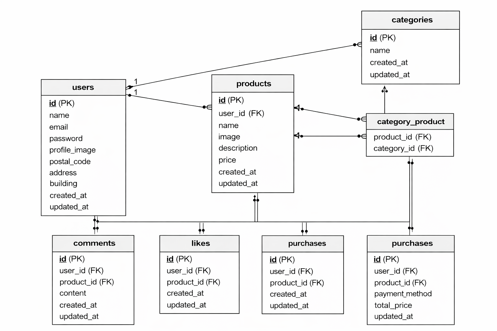

# アプリケーション
フリマアプリ（商品売買サービス）

本アプリケーションは、ユーザーが商品を出品・購入できるフリマサービスです。 
会員登録・ログイン機能を備え、商品検索、いいね、コメント、購入機能などを実装しています。 

## 環境構築

### 1. Docker ビルド
・git clone git@github.com:tsumika0524/Furima.git 
・docker-compose build

### Laravel環境構築
docker-compose up -d 
docker exec -it Furima bash 
cp .env.example .env 
php artisan key:generate 
composer install 
npm install 
npm run dev 
php artisan migrate 
php artisan db:seed 

#### 環境開発URL
・商品一覧：http://localhost 
・マイリスト：http://localhost/?tab=mylist 
・ログイン:http://localhost/login 
・商品詳細: http://localhost/item/{item_id} 
・商品購入：http://localhost/purchase/{item_id} 
・住所変更：http://localhost/purchase/address/{item_id} 
・商品出品：http://localhost/sell 
・プロフィール：http://localhost/purchase/mypage 
・プロフィール編集：http://localhost/mypage/profile 
・購入商品一覧：http://localhost/mypage?page=buy 
・出品商品一覧：http://localhost/mypage?page=sell 

##### 使用技術(実行環境)
・PHP 8.4.13 
・Laravel 8.83.29 
・MySQL 8.0.26  
・nginx 1.21.1  
・jquery 3.7.1.min.js 

######　ER図
